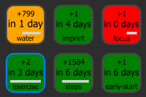
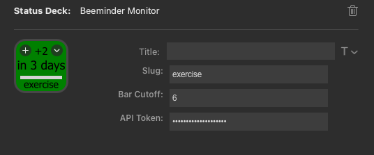

# stream-deck-beeminder
A plugin for visualizing the status of [Beeminder](https://www.beeminder.com) goals on the [Elgato Stream Deck](https://www.elgato.com/us/en/p/stream-deck-mk2-black)

### Screenshot

### Description
The plugin uses a single button to display the status of a Beeminder goal.
- The background color matches the current status of the goal
- At the top is the needed values to avoid derail
- The deadline for derail displayed below
- The bottom is the slug for the goal
- The white bar in between displays the current day progress towards the goal, regardless of color. Thus, if you have a goal that requires 10,000 steps a day, and you have done 7,500, the bar will be 75% background color and 25% white.

### Settings

- Title: Leave blank
- Slug: the slug for your goal (find in the url)
- Bar Cutoff: If you have more or equal to this number of days before derail, the daily bar will not be shown.
- API Token: Get your api token [here](https://www.beeminder.com/api/v1/auth_token.json). This is shared between all buttons and is stored securely.

